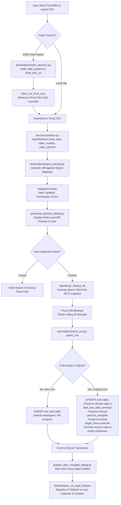
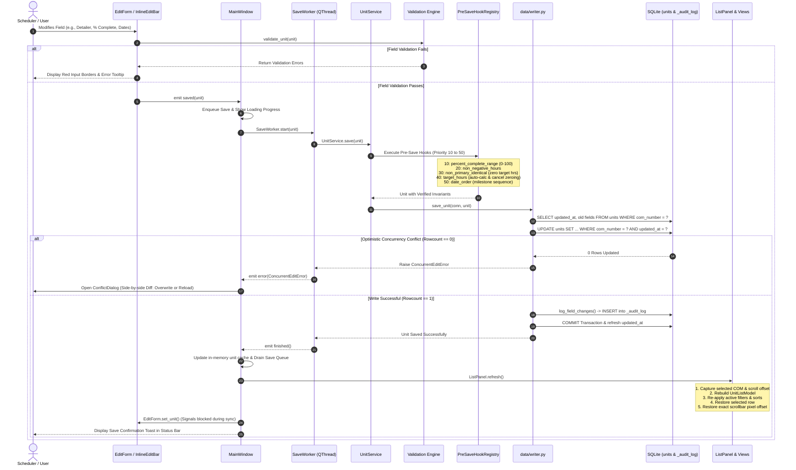
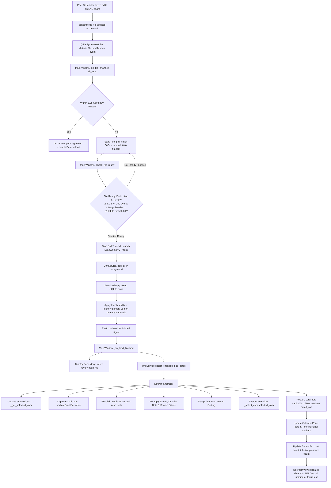

# SQL-Schedule-Tracker: Layman's Mental Map & Architecture Guide

> **Version:** 1.0.8  
> **Target Audience:** Developers, System Architects, Quality Engineers, and Non-Technical Stakeholders  
> **Purpose:** A comprehensive, plain-English mental model and technical architectural reference for the `SQL-Schedule-Tracker` manufacturing scheduling system.

---

## Table of Contents
1. [Executive Summary & The Big Picture](#1-executive-summary--the-big-picture)
   - [The Factory Analogy: Air Traffic Control for Manufacturing Detailing](#the-factory-analogy-air-traffic-control-for-manufacturing-detailing)
   - [Why This System Exists: From Spreadsheet Chaos to Real-Time Synchronicity](#why-this-system-exists-from-spreadsheet-chaos-to-real-time-synchronicity)
   - [The Complete Life Cycle of a Unit (COM #)](#the-complete-life-cycle-of-a-unit-com-)
2. [Subsystem Anatomy & Component Breakdown](#2-subsystem-anatomy--component-breakdown)
   - [Subsystem 1: The Ingest Pipeline (`automation/`, `services/import_service.py`, `services/sanitizer.py`)](#subsystem-1-the-ingest-pipeline)
   - [Subsystem 2: Data & Business Logic Layer (`data/`, `services/`)](#subsystem-2-data--business-logic-layer)
   - [Subsystem 3: The Presentation Layer (`gui/`)](#subsystem-3-the-presentation-layer)
   - [Subsystem 4: Serverless Multi-User Sync & Auto-Update (`sync/`, `services/update_service.py`)](#subsystem-4-serverless-multi-user-sync--auto-update)
3. [Visual Data Flow & Interaction Diagrams](#3-visual-data-flow--interaction-diagrams)
   - [Diagram 1: The Import Lifecycle Flowchart](#diagram-1-the-import-lifecycle-flowchart)
   - [Diagram 2: The Edit & Save Sequence Diagram](#diagram-2-the-edit--save-sequence-diagram)
   - [Diagram 3: The Multi-User Sync & Refresh Loop](#diagram-3-the-multi-user-sync--refresh-loop)
4. [Key Business Rules & Special Mechanics](#4-key-business-rules--special-mechanics)
   - [Rule 1: Stale Date Thresholds (30-Day Archive Logic)](#rule-1-stale-date-thresholds-30-day-archive-logic)
   - [Rule 2: Target Department Hours & Override Mechanics](#rule-2-target-department-hours--override-mechanics)
   - [Rule 3: Novelty Detection & Description Tag Parsing](#rule-3-novelty-detection--description-tag-parsing)
   - [Rule 4: Unit Cancellation & Zero-Hour Safeguards](#rule-4-unit-cancellation--zero-hour-safeguards)
   - [Rule 5: Asynchronous Worker Threads & Non-Blocking GUI](#rule-5-asynchronous-worker-threads--non-blocking-gui)
5. [Layman's Glossary & Mental Model Decoder](#5-laymans-glossary--mental-model-decoder)

---

# 1. Executive Summary & The Big Picture

## The Factory Analogy: Air Traffic Control for Manufacturing Detailing

Imagine a massive custom manufacturing plant that builds complex, custom-engineered industrial air handlers and electrical enclosures. Before steel can be laser-cut, bent, welded, or wired on the shop floor, every single unit must undergo **Detailing**—the rigorous drafting phase where computer-aided design (CAD) blueprints, sheet-metal punch files, structural layouts, and electrical schematics are meticulously produced and verified.

In this manufacturing environment:
* **The Flight (The "COM #"):** Each individual physical unit ordered by a customer is assigned a unique 4-to-6 digit **Commercial Order Manufacturing Number** (e.g., `COM 19895`). This COM number is the unit's permanent birth certificate and flight identifier.
* **The Flight Plan (The ERP / SSRS Master Report):** Corporate enterprise resource planning (ERP) databases track customer delivery dates, order revisions, and overall budget allowances. Every morning, these schedules are published via corporate SQL Server Reporting Services (SSRS).
* **The Pilots (Detailers / Draftsmen):** Highly skilled technical drafters responsible for modeling the unit in 3D CAD software and generating fabrication drawings.
* **The Flight Safety Inspectors (Checkers):** Senior engineers who review drafted blueprints for clash detection, code compliance, and structural integrity before steel is cut.
* **Air Traffic Control (SQL-Schedule-Tracker):** The centralized, real-time command tower that tracks every flight from arrival to touchdown. It prevents runway collisions (over-scheduling detailers beyond their 4-day working capacity), alerts controllers to approaching storms (overdue due dates or checking bottlenecks), and ensures all controllers (schedulers on the local network) see the exact same radar screen without overwriting each other's flight plans.

```
┌───────────────────────────────────────────────────────────────────────────────────────────┐
│                           THE AIR TRAFFIC CONTROL MENTAL MODEL                            │
├───────────────────────────────────────────────────────────────────────────────────────────┤
│  Corporate Radar        Incoming Flights       Flight Assignment       Inspection Gate    │
│  ┌──────────────┐       ┌──────────────┐       ┌──────────────┐        ┌──────────────┐   │
│  │ Corporate    │ ────► │ Unassigned   │ ────► │ Assigned to  │ ─────► │ Moved to     │   │
│  │ SQL / SSRS   │       │ Flight Queue │       │ Detailer CAD │        │ Checking Eng │   │
│  └──────────────┘       └──────────────┘       └──────────────┘        └──────────────┘   │
│                                                                               │           │
│                                Touchdown / Cleared for Production             ▼           │
│                             ┌──────────────────────────────────────┐   ┌──────────────┐   │
│                             │ 100% Complete & Released to Factory  │ ◄─│ Detailing    │   │
│                             │ (Status Green - Cleared for Fab)     │   │ Approved     │   │
│                             └──────────────────────────────────────┘   └──────────────┘   │
└───────────────────────────────────────────────────────────────────────────────────────────┘
```

---

## Why This System Exists: From Spreadsheet Chaos to Real-Time Synchronicity

Prior to `SQL-Schedule-Tracker`, manufacturing detailing schedules were managed across shared Excel spreadsheets on local network drives. This legacy approach created severe operational friction:

1. **The Shared File Lockout:** If Scheduler Alice opened the master spreadsheet to assign drafting hours, Scheduler Bob was locked out with a read-only warning.
2. **ERP Disconnection & Manual Data Entry:** When corporate sales pushed back a ship date or added 40 engineering hours in corporate ERP, schedulers had to manually re-type values row by row, leading to transcription errors.
3. **Accidental Data Overwrites:** Overwriting an ERP due date would wipe out a scheduler's manual notes, check history, or custom capacity adjustments.
4. **Phantom Capacity:** Identical duplicate units on multi-unit contracts were counted multiple times in aggregate workload calculations, misleading plant leadership into believing drafters were overloaded when identical units required zero additional drafting time.

`SQL-Schedule-Tracker` solves these problems by providing a **serverless, multi-user desktop application** powered by SQLite, PyQt5, and local area network (LAN) synchronization. It merges external corporate ERP reports automatically while fiercely protecting every note, assignment, and manual adjustment made by shop floor schedulers.

---

## The Complete Life Cycle of a Unit (COM #)

Every manufacturing unit moves through a deterministic 7-stage life cycle from initial enterprise order entry to shop floor fabrication release:

```
  Stage 1: External SSRS ERP Report Generation
     │
     ▼
  Stage 2: Detailing Assignment (Inbox Arrival)
     │
     ▼
  Stage 3: Hours Estimation & Capacity Gate
     │
     ▼
  Stage 4: Drafting & Checking Progress Milestones
     │
     ▼
  Stage 5: Dynamic Status Color Progression (Gray ➔ Yellow ➔ Purple ➔ Orange ➔ Green / Red)
     │
     ▼
  Stage 6: Manufacturing State Milestones (Pre-Load ➔ Pre-Eng ➔ Fab-Load ➔ Fab-Lock ➔ Fab-Eng ➔ Done)
     │
     ▼
  Stage 7: Shop Floor Release or Zero-Hour Cancellation
```

### Stage 1: External SSRS ERP Report Generation
The customer signs a contract for an industrial unit. Corporate project managers enter the order into corporate ERP systems. The central SQL database generates an automated detailing report via SQL Server Reporting Services (SSRS) containing customer name, job name, contract number, scheduled detailing due date, build date, and estimated department hours.

### Stage 2: Detailing Assignment (Inbox Arrival)
The scheduler opens `SQL-Schedule-Tracker` and clicks **🌐 Pull SSRS**. The application fetches the latest data via Windows Single Sign-On (NTLM SSO), cleans dirty formatting, detects new rows, and presents a dry-run preview. Upon confirmation, the new COM arrives in the scheduler's inbox in an **Unassigned** state (`detailer = '— Unassigned —'`).

### Stage 3: Hours Estimation & Capacity Gate
The lead scheduler assigns the unit to a specific draftsman (e.g., "John Doe"). The system evaluates John's working calendar (e.g., 4 days/week, Monday through Thursday, 10 hours/day). It automatically computes **Target Department Hours** by subtracting any internal IEC hours:
$$\text{Target Department Hours} = \max(0.0, \text{Department Hours} - \text{IEC Internal Hours})$$
If the unit is part of an identical multi-unit contract, the primary unit carries the drafting hours while non-primary identical units have their target drafting hours automatically set to `0.0` to prevent phantom capacity overloads.

### Stage 4: Drafting & Checking Progress Milestones
The assigned detailer begins drafting and the schedule records three critical chronological milestones:
1. **Detailing Start Date (`unit_detailing_start_date`):** The date the drafter opens CAD and begins modeling.
2. **Moved to Checking Date (`unit_moved_to_checking_date`):** The date the completed drawing package is submitted to engineering checking.
3. **Detailing Completion Date (`unit_detailing_completion_date`):** The date checking approves the drawings and the unit is officially released to manufacturing.

### Stage 5: Dynamic Status Color Progression
The system continuously recalculates the unit's visual health badge using real-time completion percentage and detailer working capacity:
* ⚪ **Gray (`●` Not Started):** $0\%$ complete, unstarted.
* 🟡 **Yellow (`◆` In Progress):** $1\%$ to $89\%$ complete, actively being drafted in CAD.
* 🟣 **Purple (`▲` Ready for Checking):** $90\%$ to $94\%$ complete, drafting finished and submitted to checking.
* 🟠 **Orange (`■` Checked & Returned):** $95\%$ to $99\%$ complete, checker corrections addressed.
* 🟢 **Green (`✓` Released / Complete):** $100\%$ complete, released to manufacturing.
* 🔴 **Red (`✕` Overdue / Capacity Miss):** The unit is overdue OR the remaining drafting hours exceed the detailer's available working days before the due date (accounting for a mandatory 4-day checking buffer).

### Stage 6: Manufacturing State Milestones
The unit synchronizes with plant-wide Order Management manufacturing states:
* `Pre-Load` ➔ `Pre-Eng` ➔ `Fab-Load` ➔ `Fab-Lock` ➔ `Fab-Eng` ➔ `Done`

### Stage 7: Shop Floor Release or Zero-Hour Cancellation
* **Normal Completion:** When the unit reaches $100\%$ progress, the completion date is recorded, the status badge turns solid green, and the final drawings are stamped for production.
* **Customer Cancellation:** If the customer cancels the order, the scheduler sets the detailer to `Cancelled`. The system instantly zeros out target drafting hours (preventing wasted capacity), exempts the unit from stale archiving (so order records remain traceable), and retains original department hours for historical accounting and audit trails.

---

# 2. Subsystem Anatomy & Component Breakdown

```
┌───────────────────────────────────────────────────────────────────────────────────────────┐
│                                APPLICATION ARCHITECTURE                                  │
├───────────────────────────────────────────────────────────────────────────────────────────┤
│                                                                                           │
│   [PRESENTATION LAYER] (PyQt5 GUI)                                                        │
│   ┌───────────────────────────────────────────────────────────────────────────────────┐   │
│   │ MainWindow  •  ListPanel  •  CalendarPanel  •  TimelinePanel  •  InlineEditBar    │   │
│   │ EditForm    •  BatchEdit  •  AuditDialog    •  Theme / CVD Engine  •  7 QThreads  │   │
│   └─────────────────────────────────────────┬─────────────────────────────────────────┘   │
│                                             │ Signals / Slots                             │
│                                             ▼                                             │
│   [BUSINESS LOGIC & COORDINATION LAYER] (Pure Python Services)                            │
│   ┌───────────────────────────────────────────────────────────────────────────────────┐   │
│   │ ServiceRegistry  •  UnitService  •  ImportService  •  SyncService  •  UpdateSvc   │   │
│   │ PreSaveHookRegistry (5 Hooks)   •  Validation Engine (UNIT_FIELD_RULES)           │   │
│   └────────────────────┬──────────────────────────────────────┬───────────────────────┘   │
│                        │                                      │                           │
│                        ▼                                      ▼                           │
│   [DATA ACCESS & STORAGE] (SQLite)           [SERVERLESS SYNC & LOCKING] (LAN Share)      │
│   ┌─────────────────────────────────────┐    ┌────────────────────────────────────────┐   │
│   │ units (40 cols) • _audit_log        │    │ LockManager (.lock via O_CREAT|O_EXCL) │   │
│   │ _schema_migrations • VACUUM INTO    │    │ RevisionStore (revisions.json)         │   │
│   │ Optimistic Concurrency (updated_at) │    │ SharedCache (units.json)               │   │
│   │ PRAGMA journal_mode=DELETE/WAL      │    │ SessionRegistry (Heartbeats 30s)       │   │
│   └─────────────────────────────────────┘    └────────────────────────────────────────┘   │
└───────────────────────────────────────────────────────────────────────────────────────────┘
```

---

## Subsystem 1: The Ingest Pipeline

**Primary Modules:** `automation/import_atomsvc.py`, `automation/import_csv.py`, `automation/import_preview.py`, `services/import_service.py`, `services/sanitizer.py`

The Ingest Pipeline is the automated digital funnel that ingests raw corporate ERP reports and securely loads them into the local scheduling database without human data entry errors.

```
   SSRS Web Server (Corporate ERP)
                │
                │ 1. Multi-Tier NTLM Authentication Cascade
                ▼
   automation/import_atomsvc.py (Raw CSV Download)
                │
                │ 2. InputSanitizer (Clean 7 Date Formats, Strips Commas, Normalizes %)
                ▼
   services/sanitizer.py (Sanitized Data Dicts)
                │
                │ 3. Dry-Run Diff Engine (Compares Incoming vs SQLite)
                ▼
   automation/import_preview.py (Categorize: New, Updated, Unchanged, Errors)
                │
                │ 4. Pre-Import Rolling Backup Rotation (VACUUM INTO)
                ▼
   data/db.py (Atomic Snapshot Created: YYYYMMDD_HHMMSS_pre_import_backup.db)
                │
                │ 5. Non-Destructive Upsert (Protects Manual Edits & Due Date History)
                ▼
   SQLite Database (units table updated, manual fields strictly preserved)
```

### 1. Resilient Multi-Tier Windows Authentication Cascade
When connecting to the corporate Microsoft SSRS ReportServer, corporate firewalls and security policies can block standard web requests. `fetch_csv_from_ssrs()` in `automation/import_atomsvc.py` deploys a 5-tier fallback cascade:
1. **PowerShell Windows SSO:** Spawns `Invoke-WebRequest -UseDefaultCredentials` to inherit the logged-in Windows Active Directory token without prompting for passwords.
2. **Curl NTLM Negotiate:** Falls back to `curl --ntlm --negotiate -u :`.
3. **Python `requests_ntlm`:** Attempts pure Python NTLM challenge-response handshakes.
4. **Windows COM `WinHttp`:** Uses `win32com` calling `WinHttp.WinHttpRequest.5.1`.
5. **Standard `urllib`:** Final fallback for open internal endpoints.

### 2. The Input Sanitizer (`InputSanitizer`)
Raw corporate exports are notorious for dirty data formatting: dates formatted as `MM/DD/YYYY`, numbers containing currency symbols or commas, percentage strings like `"75.5%"`, and COM numbers with extra prefixes. `services/sanitizer.py` normalizes all data:
* **7 Date Formats Supported:** Normalizes `YYYY-MM-DD`, `MM/DD/YYYY`, `M/D/YYYY`, `YYYY/MM/DD`, `MM-DD-YYYY`, `DD-Mon-YY`, and Excel epoch floats into strict ISO `YYYY-MM-DD`.
* **COM Number Cleaning:** Strips non-digit prefixes (e.g., `"COM# 19895 "` ➔ `"19895"`).
* **Number & Percentage Normalization:** Strips commas, handles NULLs, and converts percentage strings to floating-point decimals.

### 3. The Dry-Run Diff Engine (`import_preview.py`)
Before touching the live database, `compute_diff()` compares incoming sanitized rows against existing SQLite records:
* **New Rows:** COMs appearing in the ERP report that do not exist in the database.
* **Updated Rows:** Existing COMs where ERP-managed columns (due dates, description, build dates, department hours) have changed. It records exact field-level diffs (`old_value` ➔ `new_value`).
* **Unchanged Rows:** Identical rows skipped to save transaction overhead.
* **Operator Preview:** Displays changes in `ImportPreviewDialog` so the scheduler can verify schedule impacts before committing.

### 4. Automated Pre-Import Backup Rotation (`data/db.py:backup_db`)
Prior to applying imports, the system executes an atomic `VACUUM INTO` command:
* Generates a timestamped snapshot: `backups/YYYYMMDD_HHMMSS_pre_import_backup.db`.
* Automatically prunes older backups to maintain a rolling window of exactly **30 pre-import backups**.

### 5. Non-Destructive Upserting (`automation/import_csv.py`)
When updating an existing unit, the upsert engine follows strict non-destructive rules:
* **Due Date Shift History:** If the ERP pushed the due date (`new_due != current_due`), the old due date is preserved into `dept_due_date_previous`.
* **Manual Progress Protection:** `percent_complete` from CSV is applied **only if the database value is currently NULL**. If a scheduler already recorded progress in the application, the human progress is never overwritten.
* **Manual Override Protection:** If a scheduler manually adjusted `target_dept_hours`, the user's override is preserved.
* **Protected Human Fields:** Scheduler notes, detailer assignments, checking statuses, and milestone dates are completely untouched by imports.

---

## Subsystem 2: Data & Business Logic Layer

**Primary Modules:** `data/models.py`, `data/db.py`, `data/loader.py`, `data/writer.py`, `services/pre_save_hooks.py`, `services/validation.py`, `services/migration_registry.py`

The Data and Business Logic layer guarantees mathematical consistency, schema integrity, and audit compliance across all scheduling operations.

```
┌───────────────────────────────────────────────────────────────────────────────────────────┐
│                           DATA & BUSINESS LOGIC ARCHITECTURE                              │
├───────────────────────────────────────────────────────────────────────────────────────────┤
│                                                                                           │
│   SQLite Database Schema (`schedule.db`)                                                  │
│   ├── units (40 Columns: Primary Key, COM Business Key, Dates, Hours, Status Color)       │
│   ├── detailers (Name, JSON Working Weekdays: e.g. '[0,1,2,3]', Display Order)           │
│   ├── default_schedule (Singleton Default Working Weekdays)                              │
│   ├── _audit_log (Granular History: COM, Field Name, Old Value, New Value, Saved By, Time)│
│   └── _schema_migrations (Migration Version, Checksum Hash, Applied Timestamp)           │
│                                                                                           │
│   Prioritized Pre-Save Hook Pipeline (`PreSaveHookRegistry`)                              │
│   ├── Priority 10: percent_complete_range (Enforces 0.0 <= percent_complete <= 100.0)     │
│   ├── Priority 20: non_negative_hours (Rejects negative department/actual/target hours)   │
│   ├── Priority 30: non_primary_identical (Forces target_department_hours = 0.0)           │
│   ├── Priority 40: target_hours (Auto-computes dept_hours - iec_hours, handles cancel)   │
│   └── Priority 50: date_order (Validates Detailing Start <= Checking <= Complete)        │
│                                                                                           │
│   Concurrency & Integrity Safeguards                                                      │
│   ├── Optimistic Concurrency: UPDATE WHERE com_number = ? AND updated_at = ?              │
│   ├── Field Audit Logger: Compares pre/post save rows and writes changes to _audit_log    │
│   └── Safe Journal Mode: WAL mode for local disks; DELETE mode for network SMB shares     │
└───────────────────────────────────────────────────────────────────────────────────────────┘
```

### 1. SQLite Schema Breakdown (40 Columns)
The `units` table stores all operational attributes for each manufacturing unit:
* **Identification:** `id` (Auto PK), `com_number` (`TEXT UNIQUE NOT NULL`), `job_name`, `top_level_number` (Contract #), `description`, `manufacturing_location`.
* **Schedule & Milestones:** `detailing_due_date`, `dept_due_date_previous`, `build_date`, `build_cycle`, `week_ending_friday`, `unit_detailing_start_date`, `unit_moved_to_checking_date`, `unit_detailing_completion_date`.
* **Hours & Capacity:** `department_hours`, `target_dept_hours`, `iec_internal_hours`, `remaining_hours`, `actual_hours`, `actual_hours_to_detail_unit`, `hour_variance`, `remaining_demand`, `hours_checking`.
* **Assignments & Status:** `detailer`, `percent_complete` ($0.0–$1.0$ in DB, $0–100\%$ in UI), `checking_status`, `late`, `same_as`, `dr_checks`, `dvl_checks`, `status_color`, `unit_state`.
* **Calculated Calendar Metrics:** `working_days_in_checking`, `working_days_until_due`, `calendar_days_until_due`, `days_diff_due_to_build`.
* **Audit & Locking:** `created_at`, `updated_at` (High-resolution timestamp for optimistic locking).

### 2. Prioritized Pre-Save Hook Pipeline
Every unit modification must pass through the `PreSaveHookRegistry` before any SQLite write transaction is executed. Hooks execute in strict ascending priority order:
1. **`percent_complete_range` (Priority 10):** Enforces that percentage is within $[0.0, 100.0]$. Raises fatal `ValidationError` if violated.
2. **`non_negative_hours` (Priority 20):** Enforces non-negative values for `department_hours`, `actual_hours`, and `target_department_hours`.
3. **`non_primary_identical` (Priority 30):** Identifies non-primary identical units and automatically zeros their target drafting hours.
4. **`target_hours` (Priority 40):** Auto-calculates $\text{target\_hours} = \max(0.0, \text{department\_hours} - \text{iec\_internal\_hours})$ for unassigned or newly entered units while preserving human overrides. For cancelled units, forces target hours to $0.0$.
5. **`date_order` (Priority 50):** Verifies chronological milestone order: $\text{Detailing Start} \le \text{Moved to Checking} \le \text{Detailing Complete}$. Emits non-fatal warning messages for operators if dates are inverted.

### 3. Optimistic Concurrency Control
To prevent two schedulers on the network from silently overwriting each other's changes:
```sql
UPDATE units 
SET detailer = ?, percent_complete = ?, updated_at = datetime('now')
WHERE com_number = ? AND updated_at = ?;
```
If Scheduler Alice and Scheduler Bob open COM 14201 at the same time, both hold `updated_at = 10:00:00.000`. When Alice saves at 10:01:00, the timestamp updates. When Bob attempts to save at 10:02:00, SQLite finds 0 rows matching his older timestamp. The system rolls back Bob's transaction, raises `ConcurrentEditError`, and opens the **Conflict Resolution Dialog** showing Bob an exact side-by-side comparison of his edits versus Alice's live changes.

### 4. Field-Level Audit Logging (`_audit_log`)
Every database write compares pre-save values with post-save values. Every individual changed column is logged with:
* `com_number`, `field_name`, `old_value`, `new_value`, `saved_by` (Windows username), and `saved_at` (millisecond timestamp).
Schedulers can right-click any unit in the UI and click **View Audit History** to see complete historical attribution.

---

## Subsystem 3: The Presentation Layer

**Primary Modules:** `gui/main_window.py`, `gui/list_panel.py`, `gui/inline_edit_bar.py`, `gui/batch_edit_dialog.py`, `gui/calendar_panel.py`, `gui/timeline_panel.py`, `gui/edit_form.py`, `gui/audit_dialog.py`, `gui/theme.py`, `gui/a11y_dialog.py`, `gui/no_scroll_filter.py`

The Presentation Layer is built on PyQt5, providing a responsive desktop interface.

```
┌───────────────────────────────────────────────────────────────────────────────────────────┐
│                                 PYQT5 GUI LAYOUT HIERARCHY                                │
├───────────────────────────────────────────────────────────────────────────────────────────┤
│  Top Global Toolbar: [📥 Import CSV] [🌐 Pull SSRS] [🔄 Refresh] [💾 Export Excel] [Search]│
├─────────────────────────────────────────────────────────┬─────────────────────────────────┤
│  View Switcher (QStackedWidget)                         │  Collapsible Right Inspector    │
│  ┌────────────────────────────────────────────────────┐ │  ┌────────────────────────────┐ │
│  │ 📅 CalendarPanel (Month view with status dots)     │ │  │ TimelinePanel              │ │
│  ├────────────────────────────────────────────────────┤ │  │ (Milestone progress bar)   │ │
│  │ 📋 ListPanel (21-column sortable/filterable grid)  │ │  ├────────────────────────────┤ │
│  │    - Custom HighlightDelegate for status colors    │ │  │ EditForm                   │ │
│  │    - ColumnChooserDialog (Column drag & hide)      │ │  │ (Categorized inputs with   │ │
│  │    - Selection & Scroll offset preservation        │ │  │  real-time dirty tracking) │ │
│  │    - [InlineEditBar] (16-field docked rapid editor)│ │  │                            │ │
│  ├────────────────────────────────────────────────────┤ │  │ [Save] [Revert] [Audit]    │ │
│  │ 🔔 AlertPanel (Detailer urgency & capacity triage) │ │  └────────────────────────────┘ │
│  └────────────────────────────────────────────────────┘ │                                 │
├─────────────────────────────────────────────────────────┴─────────────────────────────────┤
│  Bottom Status Bar: [Loading / Save Message] [Unit Count] [Sync Status Widget] [👤 Online]│
└───────────────────────────────────────────────────────────────────────────────────────────┘
```

### 1. View Switcher & Central Panels
* **`ListPanel`:** High-density 21-column table view displaying all units. Features multi-column filtering (status, detailer, date presets, COM search, stale toggles, cancelled toggles), header-click sorting, column reordering/persistence, and custom delegate painting.
* **`CalendarPanel`:** Interactive month calendar rendering up to 6 status-colored dots per date cell and event count badges.
* **`AlertPanel`:** Workload triage board grouping units by urgency level (Overdue, $\le 7$ days, $\le 14$ days, On Track) and highlighting checking bottlenecks.
* **`TimelinePanel`:** Milestone bar chart visualizing drafting progress, checking duration, due dates, and a red dashed "TODAY" marker.
* **`EditForm`:** Deep inspection panel with categorized identity, numeric, and date inputs. Uses signal blocking during population to prevent false dirty triggers.
* **`InlineEditBar`:** 16-field rapid-editing bar docked at the bottom of the List table allowing schedulers to make single-keystroke updates with Enter-key saving.
* **`BatchEditDialog`:** Bulk-editing modal triggered when multiple units are selected, allowing simultaneous reassignment of detailers, due dates, and percentages.

### 2. Theme & CVD Accessibility Engine (`gui/theme.py`)
The system provides comprehensive visual accessibility compliant with WCAG AA contrast standards:
* **Themes:** Seamless Dark and Light desktop themes with high-contrast boost mode.
* **Color Vision Deficiency (CVD) Modes:**
  * **Deuteranopia (Red-Green):** Swaps green to dark teal (`#0f766e`) and red to deep crimson (`#7f1d1d`).
  * **Protanopia (Red-Green):** Swaps red to navy blue (`#1e3a8a`) and green to amber (`#92400e`).
  * **Tritanopia (Blue-Yellow):** Swaps yellow to deep raspberry (`#9d174d`) and accent to teal.
* **Shape-Coded Status Badges:** Status levels pair colors with unique geometric symbols so meaning is never communicated by color alone:
  * ⚪ `●` Unstarted ($0\%$)
  * 🟡 `◆` In Progress ($1–89\%$)
  * 🟣 `▲` Ready for Checking ($90–94\%$)
  * 🟠 `■` Checked & Returned ($95–99\%$)
  * 🟢 `✓` Complete ($100\%$)
  * 🔴 `✕` Overdue / Capacity Constrained
  * ⚠️ `⚠` Unassigned

### 3. Mouse-Wheel Accidental Edit Prevention (`NoScrollEventFilter`)
To prevent operators from accidentally changing dates, percentages, or detailers while scrolling down the page, `gui/no_scroll_filter.py` intercepts `QEvent.Wheel` events on all combo boxes, spin boxes, and date editors.

---

## Subsystem 4: Serverless Multi-User Sync & Auto-Update

**Primary Modules:** `sync/lock_manager.py`, `sync/revision_store.py`, `sync/shared_cache.py`, `sync/session_registry.py`, `services/sync_service.py`, `services/update_service.py`

`SQL-Schedule-Tracker` operates entirely **serverless** across standard Windows network file shares (SMB/UNC paths) without requiring a dedicated server process.

```
┌───────────────────────────────────────────────────────────────────────────────────────────┐
│                        SERVERLESS NETWORK COORDINATION ARCHITECTURE                       │
├───────────────────────────────────────────────────────────────────────────────────────────┤
│                                                                                           │
│   Windows Network File Share (`\\server\share\UnitTracker\`)                             │
│   ├── .lock Files (Atomic mutual exclusion via O_CREAT|O_EXCL, 60s stale lock stealing)   │
│   ├── revisions.json (Per-COM revision integers: com_number, revision, fingerprint)       │
│   ├── units.json (SharedCache unit snapshot dictionaries for zero-delay conflict diffs)   │
│   └── sessions/<username>@<machine>.json (Heartbeat presence files polled every 30s)      │
│                                                                                           │
│   Local Client Change Detection & Refresh                                                 │
│   ├── QFileSystemWatcher detects external file writes on schedule.db                      │
│   ├── 5.0-second Cooldown Debounce prevents mid-write reload storms                       │
│   ├── Binary Header Validation verifies b"SQLite format 3\x00" and size >= 100 bytes      │
│   └── Zero-Scroll-Jump Reload in ListPanel preserves exact row selection and scroll offset│
│                                                                                           │
│   Automated Network Deployments & Updates (`UpdateService`)                              │
│   ├── Semantic Version Comparison (compares local vs network share version.txt)           │
│   ├── Smart YAML Config Merging (preserves user settings while inheriting new release keys│
│   └── Detached robocopy Batch Script (%TEMP%\update_detailing_schedule.bat)              │
│       - Strips PyInstaller _MEIPASS environment variables                                 │
│       - Waits for process exit, mirrors binaries, and relaunches application cleanly      │
└───────────────────────────────────────────────────────────────────────────────────────────┘
```

### 1. Atomic File Locking (`LockManager`)
When executing write operations across network shares, `LockManager` acquires a named lock file (`<name>.lock`) using Python's atomic `os.open(path, O_CREAT | O_EXCL)`.
* **Stale Lock Stealing:** If a client crashes while holding a lock, locks older than `LOCK_TIMEOUT = 60` seconds are automatically unlinked.
* **RAII Context Managers:** Locks are acquired via `write_lock()` and `commit_lock()` context managers, guaranteeing release even if exceptions occur.

### 2. Per-COM Revision Tracking & Shared Cache
* **`RevisionStore` (`revisions.json`):** Tracks monotonic integer revision numbers per unit. If Client B tries to save a unit based on Revision 3 when Revision 4 has already been committed by Client A, `RevisionConflictError` is raised.
* **`SharedCache` (`units.json`):** Maintains serialized JSON snapshots of current units on the network share. When concurrency conflicts occur, `ConflictDialog` retrieves remote values instantly from cache without expensive database reloads.

### 3. Session Presence Heartbeats (`SessionRegistry`)
Every client writes a heartbeat file to `sessions/<owner_id>.json` every 30 seconds. Clients scan this directory to display connected peers in the status bar (e.g., `"👤 2 others online"`). Sessions idle for $>90$ seconds are automatically pruned.

### 4. Background Detection & Zero-Scroll UI Reload
When another user saves changes to the shared SQLite database:
1. `QFileSystemWatcher` detects the file modification.
2. The system initiates a **5.0-second debounce cooldown** to let all file operations complete.
3. A verification loop checks that the file is non-empty ($\ge 100$ bytes) and begins with the valid SQLite binary magic header `b"SQLite format 3\x00"`.
4. Asynchronous `LoadWorker` reloads units in the background.
5. `ListPanel.refresh()` records the current selected COM and vertical scrollbar pixel offset, updates the table model, reapplies active filters and sorts, and restores the exact selection and scrollbar position without visual jumping.

### 5. Automated Network Deployment & Upgrades (`UpdateService`)
When new software versions are published to the network share:
1. `UpdateCheckWorker` compares local `version.txt` with remote `version.txt`.
2. If newer, `smart_merge_config()` deep-merges local user settings into the new configuration template, ensuring custom paths, column widths, and theme choices are preserved.
3. A detached batch script (`%TEMP%\update_detailing_schedule.bat`) is generated. It strips PyInstaller runtime variables (`_MEIPASS`), waits for the application to close, executes a mirrored `robocopy` excluding user databases and logs, and restarts the updated application.

---

# 3. Visual Data Flow & Interaction Diagrams

## Diagram 1: The Import Lifecycle Flowchart

The following diagram traces the complete ingest pipeline from external SSRS web services to SQLite persistence and UI notification.



---

## Diagram 2: The Edit & Save Sequence Diagram

The following sequence diagram details how user inputs in the UI pass through validation, pre-save hooks, optimistic concurrency checks, audit logging, and reactive signal broadcasts.



---

## Diagram 3: The Multi-User Sync & Refresh Loop

The following diagram illustrates how external changes from peer schedulers are safely detected, debounced, validated, and rendered without UI disruption.



---

# 4. Key Business Rules & Special Mechanics

## Rule 1: Stale Date Thresholds (30-Day Archive Logic)

In manufacturing scheduling, tracking historical completed units is necessary, but cluttering the daily dispatch board with old completed orders degrades responsiveness and focus.

```
                  Past Due Date                           Today
  ──────────────────────┬───────────────────────────────────┼──────────►
                        │ ◄─────── 30 Days ───────►         │
     STALE (Archived)   │        ACTIVE SCHEDULING BOARD    │
   (Hidden by default)  │        (Always visible in UI)     │
```

* **The 30-Day Rule (`data/models.py:STALE_THRESHOLD_DAYS = 30`):** A unit is classified as **stale** if its `detailing_due_date` is more than 30 days in the past:
  $$\text{is\_stale} = \text{detailing\_due\_date} < (\text{today} - 30\text{ days})$$
* **The Critical Invariant Exceptions:**
  * **Unassigned Units are NEVER Stale:** If a unit has not been assigned to a detailer (`is_assigned == False`), `is_stale` strictly returns `False`. Unassigned work must never vanish silently into an archive view.
  * **Cancelled Units are NEVER Stale:** Cancelled orders (`is_cancelled == True`) are exempted from stale archiving so schedulers can search and review cancelled contracts on demand.
* **UI Behavior & Toggling:** Stale units are hidden by default in `ListPanel` and `CalendarPanel`. Schedulers can toggle the **"Show Stale"** button or apply custom date ranges to inspect archived projects.

---

## Rule 2: Target Department Hours & Override Mechanics

Corporate ERP reports list total engineering department hours (`department_hours`), but that number does not always represent the net CAD drafting work required from a draftsman.

* **Net Workload Formula:**
  $$\text{Target Department Hours} = \max(0.0, \text{Department Hours} - \text{IEC Internal Hours})$$
* **The Identicals Rule:** When a customer orders 5 identical air handlers under the same contract number (`top_level_number`), only the first unit (the **Primary Identical**, determined by earliest due date and lowest COM number) requires full CAD drafting from scratch. The remaining 4 units are duplicate copies.
  * The system automatically flags non-primary identicals (`is_non_primary_identical = True`) and forces their active `target_department_hours = 0.0`.
  * **Database Protection:** When saving, `save_unit()` writes the original engineering hours back to the database. If order compositions change in the future, the underlying engineering hours are never lost.
* **Manual Override Preservation:** Schedulers can manually override target hours in the `EditForm` or `InlineEditBar`. The `target_hours_hook` detects manual non-zero overrides and preserves human entries without overwriting them.

---

## Rule 3: Novelty Detection & Description Tag Parsing

**Module:** `data/tag_parser.py`, `UnitTagRepository`

When assigning jobs to draftsmen, schedulers need to know whether a unit contains complex, unusual, or first-time engineering features that a specific detailer has never drafted before.

```
  Raw SSRS Description String:
  "O)2 8X8X13 *PRE-PAINT* VFD UV HWHL KDOWN SEIS-CERT"
                         │
                         ▼ (services/tag_parser.py)
  ┌────────────────────────────────────────────────────────┐
  │ Unit Type:     O)2                                     │
  │ Dimensions:    8X8X13                                  │
  │ Flags:         *PRE-PAINT*                             │
  │ Features:      VFD, UV, HWHL, KDOWN, SEIS-CERT         │
  └────────────────────────────────────────────────────────┘
                         │
                         ▼ (UnitTagRepository)
  Detailer Experience Matching (e.g. Detailer John Doe)
  ├── Has John ever detailed an 'O)2' unit? ───────► YES
  ├── Has John ever detailed 'SEIS-CERT'? ────────► NO (New Feature!)
  └── Has John ever detailed this exact combo? ───► NO (New Combo!)
                         │
                         ▼
  UI Badge Display: "✦ Novelty Detected: New feature(s): SEIS-CERT"
```

1. **Regex Feature Extraction (`parse_description`):**
   * **Unit Type Prefixes:** Identifies patterns like `O)2`, `I)3`, `RTF`.
   * **Dimensions:** Extracted via regex `DIMENSION_PATTERN` (e.g., `8X8X13`).
   * **Flags:** Extracted between asterisks (e.g., `*PRE-PAINT*`).
   * **Feature Tokens:** Tokenized against a strict **42-token whitelist** (e.g., `VFD`, `UV`, `HWHL`, `KDOWN`, `AL-BASE`, `DEF-PRIORITY`).
2. **Detailer Experience Repository (`UnitTagRepository`):**
   * Dynamically indexes every unit a detailer has successfully completed in history.
   * `is_novel_for_detailer(unit, detailer)` checks for:
     1. Brand new unit types.
     2. Brand new individual features.
     3. Brand new feature combinations.
   * Surfaces a golden novelty badge (`✦`) in the UI, alerting the lead scheduler to pair the junior drafter with a senior mentor.

---

## Rule 4: Unit Cancellation & Zero-Hour Safeguards

When a customer cancels an industrial manufacturing order, the scheduling system must prevent cancelled units from corrupting capacity demand while preserving financial history.

* **Cancellation Trigger:** The detailer field is set to `Cancelled` (`Unit.is_cancelled == True`).
* **Zero-Hour Rule:** The `target_hours_hook` immediately forces `target_department_hours = 0.0`. Cancelled units consume zero drafting capacity on plant schedules.
* **Historical Quoting Retention:** The raw `department_hours` column remains completely intact in SQLite, preserving quoting history and accounting metrics.
* **Stale Exemption:** Cancelled units are never marked stale (`is_stale == False`), preventing cancelled contracts from disappearing from audit searches.
* **UI Filtering:** Cancelled units are hidden by default from the active `ListPanel`, `CalendarPanel`, and `AlertPanel` unless the operator checks the **"Show Cancelled"** filter.
* **Reassignment Recovery:** If an order is un-cancelled and assigned back to an active detailer, the pre-save hook automatically restores target drafting hours:
  $$\text{target\_department\_hours} = \max(0.0, \text{department\_hours} - \text{iec\_internal\_hours})$$

---

## Rule 5: Asynchronous Worker Threads & Non-Blocking GUI

In desktop application development, executing heavy disk I/O, network queries, or database transactions on the main user interface thread causes the operating system window to freeze and display "(Not Responding)".

To guarantee a 60 FPS user experience, `SQL-Schedule-Tracker` offloads all heavy operations to 7 dedicated `QThread` background workers:

| Worker Class | Operation Offloaded | Background Task | Completion Handler |
|:---|:---|:---|:---|
| `LoadWorker` | Database Reading | Loads hundreds/thousands of units, computes identicals, builds tag repositories. | `_on_load_finished`: Restores viewports and selection without scroll jump. |
| `SaveWorker` | Database Writing | Runs pre-save hooks, executes SQLite updates, writes audit log records. Serialized via `_save_queue`. | `_on_save_finished`: Commits unit to memory, synchronizes inspector forms, drains queue. |
| `PullSSRSWorker` | Web I/O & Diffing | Queries SSRS ReportServer via NTLM SSO, downloads CSV, computes dry-run diff. | `_on_pull_ssrs_finished`: Opens `ImportPreviewDialog`. |
| `CSVDiffWorker` | Local File Diffing | Parses local CSV file and compares against SQLite records. | `_on_csv_diff_finished`: Opens `ImportPreviewDialog`. |
| `CSVImportWorker` | Ingest Execution | Executes pre-import backup and applies non-destructive SQLite upserts. | `_on_csv_import_finished`: Displays import summary toast and reloads views. |
| `ExcelExportWorker`| Workbook Writing | Overwrites Excel `Current List` master sheet using openpyxl. | `_on_export_finished`: Displays row count confirmation toast. |
| `UpdateCheckWorker`| Network Query | Queries network deployment folder for new `version.txt`. | `_on_update_check_finished`: Prompts user if update is available. |

* **Loading Overlay:** Long operations trigger a semi-transparent animated arc spinner (`LoadingOverlay`) with a 200ms anti-flicker delay.
* **Close Progress Dialog (`CloseProgressDialog`):** If a user attempts to exit the application while `SaveWorker` threads are writing to SQLite, a non-cancelable progress dialog holds the window open until the background transaction commits cleanly, preventing database corruption.

---

# 5. Layman's Glossary & Mental Model Decoder

To ensure absolute clarity across technical and non-technical team members, every acronym and specialized concept is explained below using real-world analogies:

### **SSRS (SQL Server Reporting Services)**
* **What it is:** Microsoft's enterprise reporting engine that generates structured reports (CSVs, web tables) from central corporate SQL databases.
* **Layman Analogy:** The corporate **Daily Newspaper**. Instead of letting every department query the live corporate mainframe directly, SSRS prints out an official, organized daily morning paper summarizing all active factory orders.

### **NTLM & Windows SSO (Single Sign-On)**
* **What it is:** Windows security protocol that authenticates network requests using the user's logged-in Windows domain credentials without asking for a password.
* **Layman Analogy:** A corporate **Security Badge Lanyard**. When you walk through factory security doors, the scanner recognizes your badge automatically without making you stop and enter a PIN code every time.

### **SQLite**
* **What it is:** A self-contained, serverless, zero-configuration SQL database engine that stores all tables, indexes, and records inside a single file on disk.
* **Layman Analogy:** A durable, high-speed **Digital Filing Cabinet in a Box**. Unlike enterprise database servers (like Oracle or SQL Server) that require dedicated server rooms and administrators, SQLite is an ultra-fast filing cabinet that sits directly on your local drive or shared folder.

### **WAL Mode vs. DELETE Journal Mode**
* **What it is:** SQLite transaction logging mechanisms controlling how database writes and rollbacks are recorded.
* **Layman Analogy:**
  * **WAL (Write-Ahead Logging):** Writing new grocery list items on a **Sticky Note Scratchpad** while other family members read the main chalkboard on the fridge. It allows readers and writers to work simultaneously at high speed on local hard drives.
  * **DELETE Mode:** Writing changes directly onto the master chalkboard while holding a physical **Lock on the Kitchen Door**. On network file shares (SMB), WAL mode can cause corruption due to shared-memory limitations across the network; switching to DELETE mode ensures bulletproof network file safety.

### **VACUUM INTO**
* **What it is:** An atomic SQLite command that creates an exact, defragmented, consistent live backup copy of the database file while the application is running.
* **Layman Analogy:** A high-speed **Instant Polarized Snapshot Camera**. It takes a perfect, crystal-clear photograph of the entire filing cabinet in a fraction of a second without requiring the office to close down or lock the filing cabinet drawers.

### **Optimistic Concurrency Locking**
* **What it is:** A database synchronization pattern where records are updated only if the record's timestamp (`updated_at`) matches the timestamp when the user originally opened it.
* **Layman Analogy:** **Numbered Claim Tickets**. When Alice and Bob both pick up ticket #42 to edit a document, Alice turns in her edit first and receives ticket #43. When Bob attempts to turn in his edit using ticket #42, the clerk says: *"Ticket #42 is already spent; please review Alice's new version (#43) before submitting your changes."*

### **CVD (Color Vision Deficiency) & WCAG AA**
* **What it is:** Accessibility engineering standards ensuring software is fully usable by individuals with color blindness (Deuteranopia, Protanopia, Tritanopia) and conforms to Web Content Accessibility Guidelines (WCAG AA 4.5:1 contrast ratios).
* **Layman Analogy:** **Traffic Light Shape & Position Standards**. A traffic light does not rely solely on color; it places Red on top, Yellow in the middle, and Green on the bottom. Similarly, `SQL-Schedule-Tracker` pairs every color with unique geometric symbols (`●`, `◆`, `▲`, `■`, `✓`, `✕`, `⚠`) and high-contrast color palettes.

### **RAII (Resource Acquisition Is Initialization) & Context Managers**
* **What it is:** A programming pattern (Python `with` blocks) guaranteeing that resources (like file locks or database connections) are automatically cleaned up and released when a code block exits, even if the program crashes.
* **Layman Analogy:** An **Automatic Spring-Loaded Door**. No matter how fast you walk through the doorway or whether you drop your groceries, the spring-loaded hinge ensures the door securely closes and latches behind you every single time.

### **UNC Paths & SMB Network Shares**
* **What it is:** Universal Naming Convention paths (e.g., `\\server\share\file.db`) used to access shared folders over Server Message Block (SMB) local network protocols.
* **Layman Analogy:** A shared **Office Notice Board in the Central Hallway** that everyone in the building can walk over and read from their own offices.

### **ERP (Enterprise Resource Planning)**
* **What it is:** Comprehensive corporate software suites (e.g., SAP, Oracle, Epicor) that manage company-wide purchasing, inventory, billing, manufacturing, and shipping schedules.
* **Layman Analogy:** The corporate **Central Nervous System**. It knows when customer checks clear, when raw steel coils arrive at the loading dock, and when final shipping trucks are scheduled to depart.

### **COM # (Commercial Order Manufacturing Number)**
* **What it is:** The unique business identifier (e.g., `COM 19895`) assigned to each physical unit manufactured by the company.
* **Layman Analogy:** The unit's **Vehicle Identification Number (VIN)**. Every car rolling off an automotive assembly line has a unique VIN stamped into its chassis; in our factory, every air handler has a COM number.

### **BVA (Boundary Value Analysis)**
* **What it is:** A rigorous software quality assurance testing technique where test cases are specifically designed around edge boundaries (e.g., testing $0\%$, $1\%$, $89\%$, $90\%$, $94\%$, $95\%$, $99\%$, $100\%$, and $101\%$).
* **Layman Analogy:** Testing an elevator's weight limit not just with normal passengers, but placing exact weights at 999 lbs, 1,000 lbs, and 1,001 lbs to guarantee the safety brake triggers at the exact boundary.

### **Debounce & Cooldown**
* **What it is:** A software timing mechanism that ignores rapid bursts of repeated events until activity settles down for a specified duration.
* **Layman Analogy:** An **Elevator Door Sensor**. When passengers are walking into an elevator, the door does not open and close frantically with every footstep; it waits until no one has crossed the threshold for 3 full seconds before closing smoothly.

### **Atomic File Operation**
* **What it is:** An all-or-nothing file system operation that either completes entirely or leaves the original file untouched, with zero risk of partial or half-written corrupted files.
* **Layman Analogy:** A **Bank ATM Cash Transfer**. The ATM never dispenses your cash while forgetting to deduct your balance, nor does it deduct your balance without dispensing your cash. It either completes both steps perfectly or aborts completely.

---

*Document compiled and verified against SQL-Schedule-Tracker v1.0.8 architecture.*
